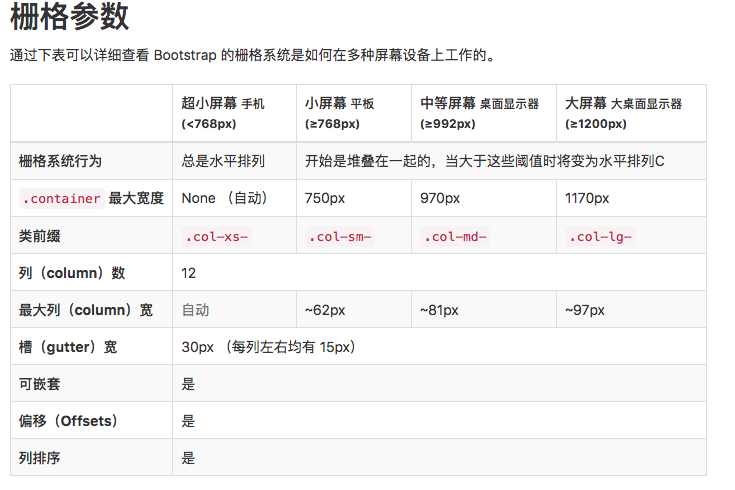

课程地址：[bootstrap 快速入门](https://www.imooc.com/learn/826)
基于 bootstrap3

## bootstrap 简介

（1）bootstrap 是 twitter 公司开发基于 HTML\CSS\javascript 的前端框架
（2）为实现 web 应用程序快速开发提供的一套前端工具包
（3）响应式布局
（4）移动设备优先

### 使用 bootstrap 通过 CDN 引入的

用 bootstrap 的话 jQuery 版本非常重要，不能太低

```JS
    <link href="https://cdn.bootcss.com/bootstrap/3.3.7/css/bootstrap.min.css" rel="stylesheet">
    <script src="https://cdn.bootcss.com/jquery/3.2.1/jquery.min.js"></script>
    <script src="https://cdn.bootcss.com/bootstrap/3.3.7/js/bootstrap.min.js"></script>
```

##目标：

- bootstrap 全局样式
- viewport 的意义
- 栅格化布局
- 字体、图标
- 实现响应式布局的开发

### Bootstrap 中的全局样式：

Bootstrap 提供了大量的全局样式，
基本的 HTML 元素均可以通过 class 设置样式并得到增强效果。

排版、表格、表单、图片

#### 标题

Bootstrap 中的排版：

Bootstrap 对默认的排版方式进行了 CSS 样式定义，使得各种基本结构套用出来的 HTML 页面更加美观。

标题：（h1~h6 都能使用，而.h1~.h6 类名能为内联元素赋予标题的样式）

字体大小皆为：

h1:36px;

h2:30px;

h3:24px;

h4:18px;

h5:14px;

h6:12px;

副标题：（small）,h 标签内用`<samll>`标签圈定副标题的内容即可

```JS
<h1>1<small>小标题</small></h1>
    <span class="h1">标题1</span>
```

### 排版-文本

p 标签默认 14px，行高 20px， 底部外边距 10px。
网页默认字体：16px

- 可以在标签中的文字加上`<mark></mark>`黄色的边框
- `<del></del>`会有删除线
- ins,u 标签都可以加上下划线
- small，strong 标签都可以进行排版

```JS
.text-left
.text-center
.text-right
.text-lowercase
// 变成小写
.text-uppercase
// 变成大写
.text-capitalize
// 首字母大写
```

### 表格

table 标签中可以加的样式

- table 表格基础样式
- table-striped 斑马线
- table-bordered 加内联边框
- table-hover 鼠标经过变色

tr 可以加不同的 class 变色
详情见 bootstrap_learning/表格.html

### 表单

- .form-control 边框带圆角还发光，还可以组合表单控件

* 所有的表单都要放到一个 form 里面去，因为会有提交选项

- class="form-group"会在控件上下加 margin

* `<form class="form-inline" action="">`表单空间水平排列

- input-lg input-sm

* <label class="sr-only" label 消失

- ```<div class="form-group has-success">
  <label class="control-label" for="">这是一个输入框</label>
  <!-- 边框颜色变化 -->
  ```
  还有 .has-warning .has-error

### 按钮 style

代码地址：bootstrap_learning/按钮.html

### 图片

.img-rounded 圆角
.img-circle 圆形
.img-thumbnail 带有边框的圆角图形

### 响应式开发 viewport(meta 标签必须得写)


一个像素代表屏幕中一个像素点
meta 标签中的 viewpoint：
`<meta name="viewport" content="width=device-width, initial-scale=1.0, 
maximum-scale=1, minimun-scale=1, user-scalable=no">`
- width（device-width）、height

- user-scalable（yes 或 no，允许或禁止用户缩放网页）、

* initial-scale（网页初始化大小原始尺寸倍数，一般为 1，原网页大小，老人机可以设大点）

- maximum-scale、minimun-scale（控制移动端网页是否可放大缩小的倍数）

响应式网页的特点：

- 事业开阔多变、信息丰富

- 排版新颖随意、设计师发挥空间较大

- 适用于 PC 和手机端

### 面试问题，不同手机边框变粗变细问题（有的屏幕是多个像素点组成的 1px）？

解决 iphone6/7/8 手机某些页面边框文字很粗的方案：

1、判断是否是视网膜屏

2、将当前页面的 scale 换成 0.5/0.3 等

3、动态生成相应的 meta 标签，插入到 html 文件头部

```JS
<script>
//手机淘宝参考
var metaEl = doc.createElement('meta');
var scale =isRetina ? 0.5:1;
// 判断是不是视网膜屏幕
metaEl.setAttribute('name','viewport');
metaEl.setAttribute('content','initial-scale='+ scale +',maximum-scale='+ scale +',minimum-scale='+ scale +','user-scalable=no');
if(docEl.firstElementChild){
  document.documentElement.firstElementChild.appendChild(metaEl);
}else{
  var wrap=doc.createElement('div');
wrap.appendChild(metaEl);
documen.write(wrap.innerHTML);
}
</script>
```

### 栅格布局（原理是 @media screen ）



bootstrap 中的响应式开发原理是栅格布局，将屏幕分为 12 等份。元素可以给根据不同屏幕的大小适应相应的大小，如 col-lg-3 col-md-4 col-sm-6 col-xs-12 col-lg-offset-3 col-md-offset-4

- col-lg-3：表示在大屏幕元素宽度大小为屏幕的 3/12,即 1/4,

- col-md-4：表示在中等屏幕元素宽度大小为屏幕的 1/3,

- col-sm-6：表示在小屏幕元素宽度大小为屏幕的 1/2,

- col-xs-12：表示在极小屏幕元素宽度大小占满整个屏幕大小。

- col-lg-offset-3：表示在大屏幕中元素的位置是距离屏幕左边为屏幕大小的 1/4,

- col-md-offset-4：表示在中等屏幕中元素的位置是距离屏幕左边为屏幕大小的 1/3

### 网页中的单位

网页开发中的单位：

- px 相对于显示屏幕分辨率的长度单位，但其大小无法跟随屏幕放大缩小，不过所有的浏览器都支持 px 单位

- em 适合手机端开发，em 是不稳定的 相对于当前文本内的字体尺寸，1em = 16px（但不完全是），em 会继承父级元素的字体大小，IE 的部分浏览器并不支持 em,em 在谷歌是 12px，在 safi 是 10px，在火狐是 18px，

- rem 与 em 类似，但是更加稳定。相对于 HTML 根节点的字体单位，rem 会继承根元素的字体大小，
  `html{font-size:62.5%}`——也就是 10 个像素（16 的 62.5%），然后想改成 16px 也就是`1.6rem`就可以了，非常简单方便。想调节网页大小只需要调节 html 里面的 font-size 的字体大小就可以了。除了 IE 基本所有浏览器都支持 rem 了。要是想兼容就都写 px 在前面 rem 在后面

### 字体图标

选取不同的 glyphicon-star 得到不同的字体图标
`<span class="glyphicon glyphicon-star"></span>`

### 下拉菜单

- 所有的要在一个 class="dropdown"的 div 里面
- 绑定`data-toggle="dropdown"`才能实现下拉

### 控件组

1. .input-group 表示控件组
2. .input-group-addon 可以放置额外内容以及图标

### 导航：

1. 以一个带有 class.nav 的无序列表开始

2. .nav-tabs 代表可切换的导航

3. .nav-pills 代表胶囊导航

4) .nav-stacked 使导航垂直

5) .nav-justified 使导航平铺居中

添加一个 active 的 class，可使得指定导航元素被选中

### 分页：

1. .pagination 在父元素中添加表示分页

2. .pager 放置在翻页区域，也就是分页和翻页的 class 是不一样的

```html
     <ul class="pager">
            <li class="active previous">
                <a href="#">left</a>
            </li>
            <li class="next">
                <a href="#">right</a>
            </li>

        </ul>
```

3. .previous 把链接向左对其，.next 把链接向右对齐

### 进度条 progress-bar

1. .progress 表示进度条
2. 通过状态类改变进度条的颜色
3. .progress-bar-striped 进度条渐变
4. progress-bar-danger 改颜色

### 列表

1. .list-group list-group-item
2. active 选中 disabled 禁用
3. .badge 状态数（例如点赞的人数）
4. 也是加-danger 什么的可以改变颜色

### 面板(面板经常用于弹窗和提示信息)：

1、.panel 代表面板

2、.panel-body 代表面板内容

3、.panel-footer 代表面板的注脚

### 插件 modal

代码地址：bootstrap_learning/modal 弹窗.html

1. jQuery 引用之后才能用 bootstrap 插件
2. data 属性

- 通过 data 属性控制页面交互
- $(document).off('.data-api')解除属性绑定

* `data-toggle="modal"`使得按钮绑定了 modal.js 方法
* `data-target`指定弹窗的位置

- 关闭 modal 功能是通过`data-dismiss="modal"`实现
